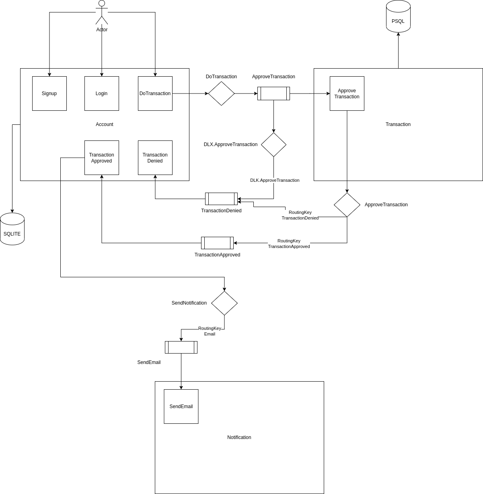

<h1 align="center">Diniz Bank</h1>

 

## Visão geral

<h3>Esse sistema conta com 3 principais microsserviços que são:</h3>
 
- Account
- Transaction
- Notification

<h3>As funcionalidades de cada microsserviço foram dividídas da seguinte forma</h3>
<h3>O serviço <b>Account</b> conta com funcionalidades que serão usadas por um cliente da plataforma, entre elas estão</h3>

- Criar uma conta
- Fazer login
- Solicitar uma transação

<h3>além disso, nele guardamos o estado de coisas relacionadas a uma conta, como dados do usuário e o valor que o mesmo possui na conta.</h3>
<h3>O serviço de <b>Transaction</b> tem uma functionalidade chamada <b>ApproveTransaction</b> que atua como autorizador de transações solicitadas no serviço de <b>Account</b>, o mesmo tem a inteligência de aprovar ou negar uma transação, baseado na resposta de uma API REST que no momento se trata de um mock para simular o serviço autorizador (https://run.mocky.io/v3/8fafdd68-a090-496f-8c9a-3442cf30dae6). No serviço de transaction também contamos com o registro de uma transação e se ela foi aprovada, negada ou até mesmo se ocorreu algum erro no serviço autorizador.</h3>
<h3>Já o serviço <b>Notification</b> é responsável por enviar notificações, seja ela para um email, SMS ou algúm outro meio de contato. Por se tratar de uma simulação, útilizamos outro mock (http://o4d9z.mocklab.io/notify), esse por sua vez pode está indisponível/instável.</h3>

## Observações

- Geral
  - A comunicação entre nossos microsserviços é efetuada via [rabbitMQ](https://rabbitmq.com)
  - Os nossos serviços contam com algúmas comportamentos e funcionalidades em casos de erros, entre eles estão
    - Retry [exponencial](https://www.baeldung.com/resilience4j-backoff-jitter#exponentialbackoff)
    - Envio da mensagem para uma [DLX](https://www.rabbitmq.com/dlx.html)
- Regras de negócio
  - Temos 2 tipos de usuários, os comuns e lojistas, ambos têm carteira com dinheiro e realizam transferências entre eles.
    - Usuários podem enviar dinheiro (efetuar transferência) para lojistas e entre usuários.
    - Lojistas só recebem transferências, não enviam dinheiro para ninguém.
  - Transferências a partir de uma conta sem saldo são possíveis
  - A operação de transferência é uma transação (ou seja, é revertida em qualquer caso de inconsistência) e o dinheiro volta para o usuário que envia.
  - No recebimento de pagamento, o usuário ou lojista recebe notificação (envio de email, sms) enviada por um serviço de terceiro.
- O sistema está desenhado da seguinte forma

   

